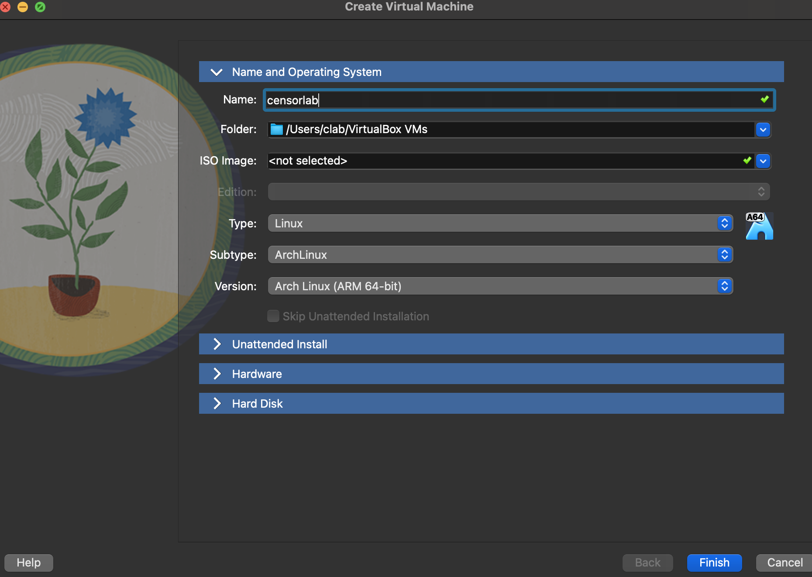
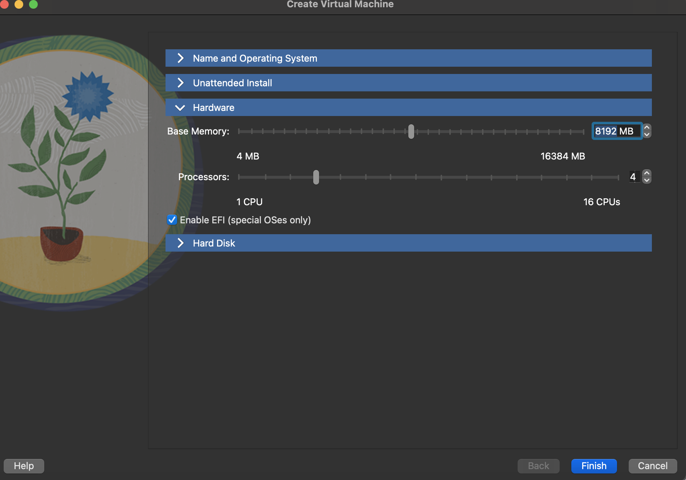
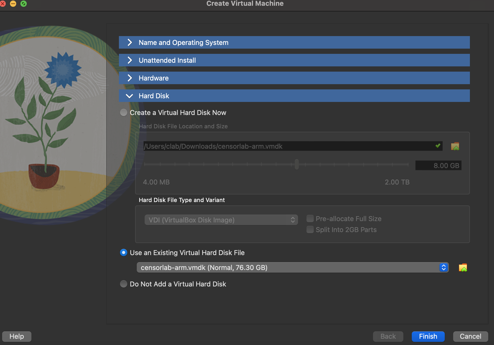

+++
title = "VM Info"
template = "markdown.html"
+++

# CensorLab VM

CensorLab provides pre-built virtual machine images with everything pre-installed: CensorLab, all dependencies, demo scenarios, and a desktop environment. This is the easiest way to get started in classroom or workshop settings.

## Requirements

- [VirtualBox](https://www.virtualbox.org/wiki/Downloads) (7.0 or later recommended)
- At least 4 CPU cores and 8 GB RAM allocated to the VM
- ~10 GB free disk space

## Download and Import

### x86\_64 (Intel/AMD)

1. Download the [x86\_64 OVA](https://voyager.cs.umass.edu/vm-images/censorlab.ova)
2. In VirtualBox, go to **File > Import Appliance**
3. Select the downloaded `.ova` file and click **Import**
4. Start the VM

### aarch64 (Apple Silicon Macs)

Due to a limitation in the Mac version of VirtualBox, aarch64 images must be imported as a drive rather than an OVA.

1. Download the [aarch64 VMDK](https://voyager.cs.umass.edu/vm-images/censorlab-arm.vmdk)
2. In VirtualBox, create a new VM with these settings:
   - **OS Type**: Arch Linux (arm64)
   - **CPU**: 4+ cores
   - **Memory**: 12 GB
3. When prompted for a disk, choose **Use an Existing Virtual Hard Disk File** and select the downloaded `.vmdk`
4. Start the VM





## First Boot

Once the VM starts, log in with:

| | |
|---|---|
| **Username** | `censorlab` |
| **Password** | `c3ns0rl4b612@@!` |

The desktop has two shortcuts:

- **CensorLab Docs** - Opens the full documentation in a browser
- **CensorLab Demos** - Opens a terminal in the demos directory

## Running CensorLab in the VM

CensorLab is pre-installed and on your `PATH`. You can run any demo immediately:

```bash
# DNS blocking
censorlab -c demos/dns_blocking/censor.toml nfq

# HTTP keyword blocking
censorlab -c demos/http_blocking/censor.toml nfq

# TLS SNI blocking (HTTPS)
censorlab -c demos/https_blocking_tls/censor.toml nfq

# QUIC blocking
censorlab -c demos/quic_blocking/censor.toml nfq

# Comprehensive GFW emulation (7 techniques combined)
censorlab -c demos/mega_gfw/censor.toml nfq
```

CensorLab automatically manages iptables rules in NFQ mode. No manual nftables setup is required.

### Try it interactively

Start the HTTPS blocking demo, then test it with curl:

```bash
# Start CensorLab in the background
censorlab -c demos/https_blocking_tls/censor.toml nfq &

# This works fine (not on the blocklist):
curl https://google.com

# This hangs (TLS ClientHello is dropped):
curl --max-time 5 https://example.com

# Stop CensorLab
fg   # bring to foreground
# Press Ctrl+C
```

### Analyzing a PCAP file

You can also analyze saved packet captures without live interception:

```bash
censorlab -c demos/dns_blocking/censor.toml pcap capture.pcap 192.168.1.100
```

## Writing a Censor Program

Create two files:

**my_censor.toml:**
```toml
[execution]
mode = "Python"
script = "my_censor.py"
```

**my_censor.py:**
```python
from dns import parse as parse_dns

def process(packet):
    udp = packet.udp
    if udp and udp.uses_port(53):
        try:
            dns = parse_dns(packet.payload)
            for q in dns.questions:
                if "example.com" in q.qname:
                    return "drop"
        except:
            pass
```

Run it:
```bash
censorlab -c my_censor.toml nfq
```

For the complete API reference covering all packet attributes, protocol parsers (DNS, TLS, QUIC), ML model integration, and the CensorLang DSL, see the [full documentation](/docs/).

## Updating the VM

The VM runs NixOS and can be declaratively updated to the latest CensorLab version:

```bash
censorlab-update
```

This fetches the latest system configuration from the CensorLab repository and rebuilds the system. No data is lost during updates.

## Troubleshooting

**SSH stops working after starting CensorLab**: CensorLab intercepts all network traffic on the interface, including SSH. Use the VirtualBox console (graphical display) instead of SSH when CensorLab is running in NFQ mode.

**Packets are being dropped unexpectedly**: Check that you don't have leftover iptables rules from a previous run. CensorLab cleans up its rules on graceful shutdown (Ctrl+C), but if the process is killed forcefully, rules may persist. Run `sudo iptables -F` to clear them.

**VM is slow**: Ensure you've allocated at least 4 CPU cores and 8 GB RAM. Enable hardware virtualization (VT-x/AMD-V) in your BIOS if not already enabled.
